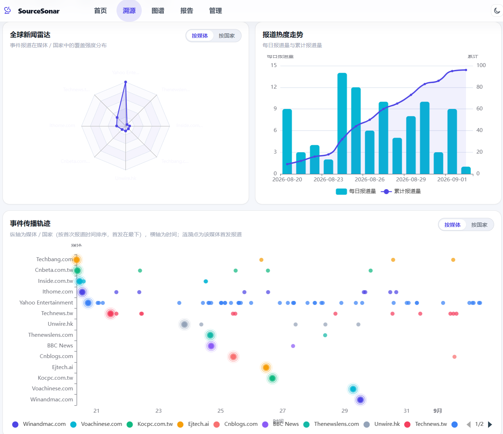
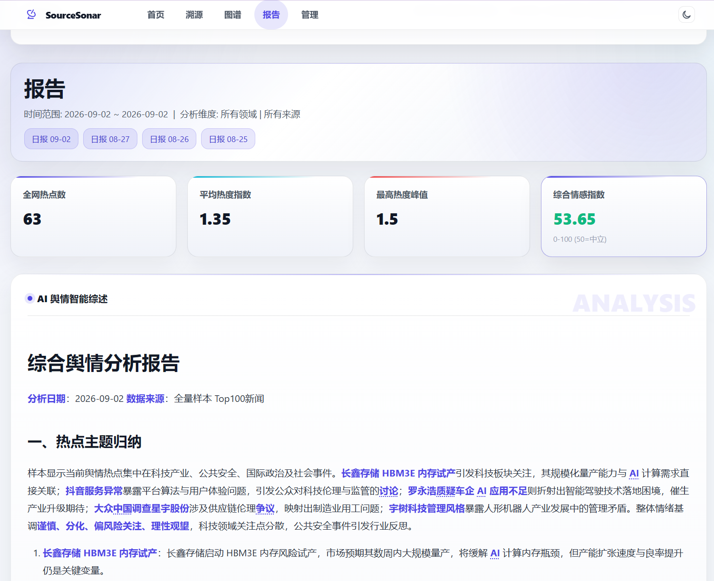
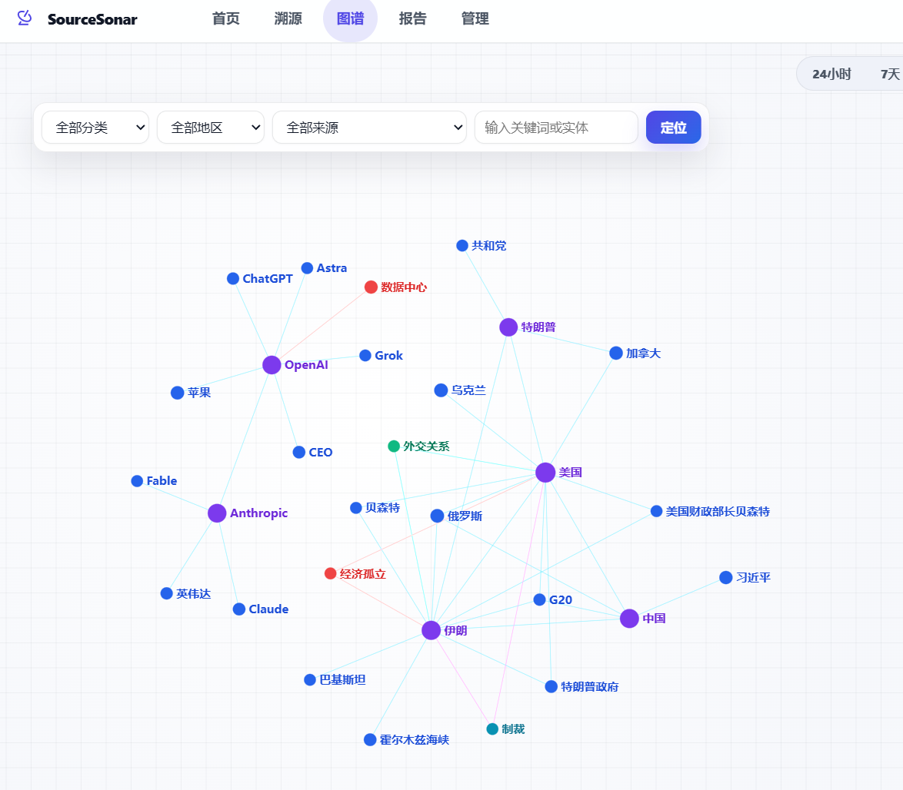

# SourceSonar v0.2.8

SourceSonar 是一个新闻聚合与舆情分析 Web 工具，持续从配置的新闻源抓取内容，结合 Embedding、OpenAI 兼容大模型和浏览器正文补抓，对新闻进行摘要、分类、情感分析、去重聚类、专题追踪和报告生成。

## 功能

- 新闻采集：支持 RSS / JSON / 网页热点源，Crawl4AI + Playwright 正文补抓并同步采集封面图、可下载视频与音频链接，管理后台可视化维护新闻源
- 热点列表：按热度/时间浏览新闻，支持时间范围、分类、地区、来源筛选
- 语义搜索：向量召回 + 文本匹配，支持自然语言查询
- AI 分析：使用 Qwen3-VL 联合分析新闻文本、图片和视频关键帧；音频先由 SenseVoice 转写，再综合生成内容、情感、分类、关键词和实体。媒体文件仅临时处理，不长期占用磁盘
- 专题追踪：自动发现候选事件簇，AI 审核生成专题，支持时间轴与趋势分析
- 图表报告：综合/关键词报告，来源分布、词云、情感分布、热度趋势、共现网络
- 图谱分析：关键词/实体网络图谱
- 事件溯源：按事件描述搜索相关新闻并梳理时间线，分析快照自动入库并支持刷新恢复与历史回看
- 智能体：支持网页搜索、正文抓取、新闻图片生成等工具调用
- 管理后台：配置管理、新闻源管理、AI 连通性测试、日志查看、提示词自定义、后台任务触发

## 界面预览

| 新闻热点与筛选                         | 专题追踪                           |
| -------------------------------------- | ---------------------------------- |
|  |  |

| 数据报告                            | 关键词与情感报告                  |
| ----------------------------------- | --------------------------------- |
|  |  |

## 技术栈

- 后端：Python / FastAPI / SQLAlchemy（异步）
- 数据库：PostgreSQL（推荐）或 SQLite
- 向量检索：AI Embedding + pgvector / NumPy
- AI：OpenAI-compatible API（主模型 + 备用模型 + 按功能路由）
- 抓取：aiohttp / Crawl4AI / Playwright
- 前端：原生 HTML/CSS/JS + ECharts

## 快速开始

### 本地运行

```bash
pip install -r requirements.txt
python main.py
```

访问 `http://localhost:8193`。

### Docker

```bash
docker-compose up -d
```

## 配置

请创建 `.env` 并填写 API Key；运行参数可在 `config.yaml` 中调整。常用配置如下：

- `DATABASE_URL`：数据库连接串，为空则使用 SQLite
- `MAIN_AI_*` / `BACKUP_AI_*`：AI 模型 Key、地址、模型名
- `EMBEDDING_MODEL`：用于向量检索；默认可使用 `Qwen/Qwen3-VL-Embedding-8B`
- `MULTIMODAL_SENTIMENT_MODEL`：多模态情感模型；可设置为 `Qwen/Qwen3-VL-30B-A3B-Thinking`
- `MULTIMODAL_SENTIMENT_*`：图片数量、大小上限、细节等级、并发和超时
- `MEDIA_*`：音视频抓取、下载上限、视频时长、关键帧数量、FFmpeg 路径与语音转写模型
- `AUTO_*`：自动任务参数
- `TOPIC_*`：专题发现参数
- `CRAWLER_*`：爬虫并发/超时/重试

## 定时任务

启动后自动调度：抓取 → 聚合 → 摘要 → 分析 → 日报/周报/月报 → 专题刷新 → 历史数据清理。

## 项目结构

```
app/
├── api/endpoints/       # API 路由（新闻、报告、专题、图谱、溯源、系统）
├── core/                # 配置、数据库、日志、提示词
├── models/              # 数据模型
├── services/            # 业务逻辑
└── utils/               # 通用工具
static/                  # 前端资源
templates/               # Jinja2 模板
config.yaml              # 配置文件
main.py                  # 应用入口
```

## 使用建议

- 初始运行数据量少，聚类、专题和报告效果有限，建议运行一段时间后再评估
- 动态页面正文补抓占用内存较高，低配机器建议将 `CRAWLER_CONCURRENCY` 设为 `1-2`
- AI 结果仅供参考，重要结论请以原文和权威来源为准

## License

MIT License
